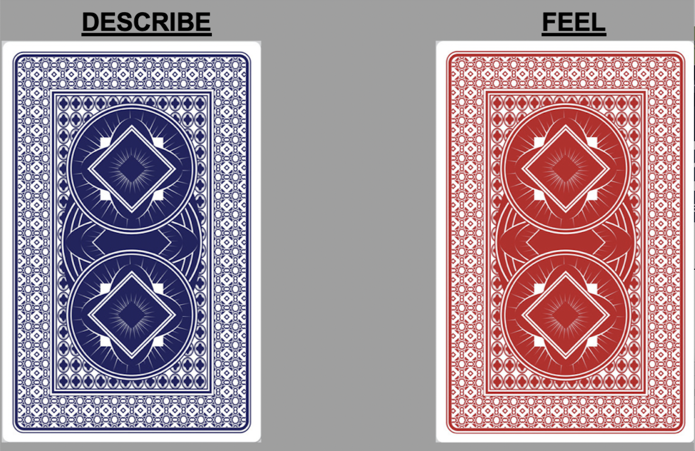

<style>

table, td, th {
  border: none;
  padding-left: 1em;
  padding-right: 1em;
  margin-left: auto;
  margin-right: auto;
  margin-top: 1em;
  margin-bottom: 1em;
}

</style>

```{cat, engine.opts = list(file = "color-text.lua")}
Span = function(span)
  color = span.attributes['color']
  -- if no color attribute, return unchange
  if color == nil then return span end
  
  -- tranform to <span style="color: red;"></span>
  if FORMAT:match 'html' then
    -- remove color attributes
    span.attributes['color'] = nil
    -- use style attribute instead
    span.attributes['style'] = 'color: ' .. color .. ';'
    -- return full span element
    return span
  elseif FORMAT:match 'latex' then
    -- remove color attributes
    span.attributes['color'] = nil
    -- encapsulate in latex code
    table.insert(
      span.content, 1,
      pandoc.RawInline('latex', '\\textcolor{'..color..'}{')
    )
    table.insert(
      span.content,
      pandoc.RawInline('latex', '}')
    )
    -- returns only span content
    return span.content
  else
    -- for other format return unchanged
    return span
  end
end
```

<!-- # Packages: -->

```{r,echo=FALSE,eval=TRUE,message=FALSE,warning=FALSE}
rm(list=ls())
#install.packages("remotes")
remotes::install_github("acoppock/attrition")
library("dplyr")
library("ggplot2")
library(Hmisc)
library(gridExtra)
library(grid)
library("stargazer")
library("hrbrthemes")
#hrbrthemes::import_roboto_condensed()
library("quanteda")
library("readtext")
library("tidyverse")
library("knitr")
library("papeR")
library(tidyr)
library(kableExtra)
library(ggpubr)
library("printr")
library("tab")
#library("lfe")
library(sjPlot)
library(clusterSEs)
library(viridis)
library(BBmisc)
library(miceadds)
library(estimatr)
library(foreign)
library(randomizr)
library(doParallel)
library(sandwich)
library("table1")
library(matrixStats)
```


```{r,echo=FALSE,eval=TRUE,message=FALSE,warning=FALSE}
# Lotem's macbook, version: Jan 11
# ----------------------------------------------------------------------
# Function 1: skip_to_attrite() [not available/necessary to users]
# ----------------------------------------------------------------------

#This function takes a matrix of 0,1s in which 1 indicates missingness (NA) per respondent per question and removes `skippers`. Skippers are individuals who have a 0s in their row followed by 1s.

skip_to_attrite<-function(arg){
    n_col = length(arg)
    for (j in 1:n_col)
       {
      if (prod(arg[j:n_col])==1)
        {
          arg[j] = 1
        } 
      else 
        {
          arg[j] = 0
         }
    }
    return(arg)
}
# ----------------------------------------------------------------------
# Function 2: attrition()
# ----------------------------------------------------------------------

#Function to transform dataframe into an attrition dataframe. The attrition dataframe indicates, per variable, how many respondents attrited [note that this dataframe does not include `skippers`, i.e. respondents who skipped questions]. The dataframe also includes a variable that is the proportion of total N attrited, calculated as number of attrited respondents / starting N, and a variable that is the proportion of attrited by n at Qi, calculated as attrited respondents /  number of respondents entering into the question.

#only works if you know the order of survey questions. 

attrition <- function(data)
  {
  #required packages
  require(ggplot2)
  require(viridis)
  require(Hmisc)
  require(dplyr)
  
  #make sure arguments are correct
  if(is.null(data))
  stop("Data is null, please supply value")
  
  if(class(data)!="data.frame")
  stop("Data must be data.frame")
  
  #for each missing value in the dataframe `dataset` give value 1, otherwise give 0.
  data <- apply(data,2,function(x) {ifelse(is.na(x),1,0)})

  #change `skippers` into 0 (we are only interested in respondents that attrited).
 
  data<-apply(data,1,skip_to_attrite)
  data<-t(data) #transpose data

  data2<-data.frame(data)

  #transform into a long dataframe, such that the variable `attrited` is the number of missing observations per variable.
 data <- data.frame(colSums(data2))
 colnames(data) <- "attrited"
 
 #transform `attrited` to measure how many respondents attrited during each question, rather than how many missing values are in each question.
 attrite_2<-data$attrited
 num_dropped <- data[-1,] - data[-nrow(data),]
 data$attrited<- c(data[1,], num_dropped)
 data$attrite_2<-attrite_2
 
  #add variable `proportion` = number of attrited respondents / number of respondents entering into the question
 data$n_prev <- nrow(data2) - as.numeric(data$attrite_2)
 data$n_prev <- Lag(data$n_prev, +1)
 data$n_prev[1] <- nrow(data2)
 data$proportion_q <-    round(data$attrited/data$n_prev,2)
 data$n_prev <- NULL
 data$attrite_2 <- NULL
 
 #proportion of attrited / starting N
  data$proportion <-    round(data$attrited/nrow(data2),2)
 
 #add variable `questions` = the name of each variable in the original dataframe.
 data$questions <- rownames(data)
 rownames(data) <- c()
 data <- data[, c(4,1,3,2)]
 
  #return dataframe
  return(data)
}

#attrition_dataset<-attrition(data = df)

# ----------------------------------------------------------------------
# Function 3: plot_attrition()
# ----------------------------------------------------------------------

#Function that allows you to plot attrition in survey data.

#`data` must be data.frame. Note that this function works only if the order of variables = order of questions in the survey.

#`freq` is a logical argument that notes the Y axis of the attrition plot. Default is freq=TRUE, which is the frequency of attrited respondents. When freq=FALSE Y axis is the proportion of total N attrited, calculated as number of attrited respondents / number of respondents entering into the question.

#`treatment` is a character of name(s) of question(s) in which treatments were administered. Marked in the plot with a red vertical line.

#`pre_treatment` is a character of name(s) of pre-treatment question(s). Marked in the plot with a green vertical line.

#`DV` is a character of name(s) of outcome question(s). Marked in the plot with a blue vertical line.

#`other_group_var` is a character of name(s) of question(s), corresponds to `other_group` category, specified by users. Marked in the plot with a purple vertical line. Note that both `other_group` and `other_group_var` must be specified to use one of the functions.

#`other_group` is a character of the name of the group of variables specified in `other_group_var`. Note that both `other_group` and `other_group_var` must be specified to use one of the functions.

plot_attrition <- function(data
                           ,freq = TRUE
                           ,treatment = NULL
                           ,pre_treatment = NULL
                           ,DV = NULL
                           ,other_group = NULL
                           ,other_group_var = NULL
                           ,title = NULL)
  { 
  #required packages
  require(ggplot2)
  require(viridis)
  require(Hmisc)
  require(dplyr)

  #make sure arguments are correctly specified
  if(is.null(data))
  stop("Data is null, please supply value")
  
  if(class(data)!="data.frame")
  stop("Data must be data.frame")
  
  if(class(freq)!="logical")
  stop("Freq must be logical. Default is freq=TRUE.")
  
  if(!is.null(treatment) & class(treatment)!="character")
  stop("Treatment must be character")
  
  if(!is.null(pre_treatment) & class(pre_treatment)!="character")
  stop("Pre_treatment must be character")
  
  if(!is.null(DV) & class(DV)!="character")
  stop("DV must be character")
  
  if(!is.null(other_group) & class(other_group)!="character")
  stop("Other_group must be character")
  
  if(!is.null(other_group_var) & class(other_group_var)!="character")
  stop("Other_group_var must be character")
  
  #both other_group_var and group_var must be specified to use either:
  if(!is.null(other_group_var) & is.null(other_group))
  stop("Specify name of other_group")
  
  if(is.null(other_group_var) & !is.null(other_group))
  stop("Specify other_group_var")

 
 #Begin by creating an attrition dataframe
 #for each missing value in the dataframe `dataset` give value 1, otherwise give 0.
  data <- apply(data,2,function(x) {ifelse(is.na(x),1,0)})

  #change `skippers` into 0 (we are only interested in respondents that attrited).
 
  data<-apply(data,1,skip_to_attrite)
  data<-t(data) #transpose data

  data2<-data.frame(data)
  
  #transform into a long dataframe, such that the variable `attrited` is the number of missing observations per variable.
 data <- data.frame(colSums(data2))
 colnames(data) <- "attrited"
 
 #transform `attrited` to measure how many respondents attrited during each question, rather than how many missing values are in each question.
 attrite_2<-data$attrited
 num_dropped <- data[-1,] - data[-nrow(data),]
 data$attrited<- c(data[1,], num_dropped)
 data$attrite_2<-attrite_2
 
  #add variable `proportion` = number of attrited respondents / starting N.
 
# data$n_prev <- nrow(data2) - as.numeric(data$attrite_2)
# data$n_prev <- Lag(data$n_prev, +1)
# data$n_prev[1] <- nrow(data2)
# data$proportion_q <-   round(data$attrited/data$n_prev,2)
 data$n_prev <- NULL
 data$attrite_2 <- NULL
 data$proportion <-    round(data$attrited/nrow(data2),2)
 
 #add variable `questions` = the name of each variable in the original dataframe.
 data$questions <- rownames(data)
 rownames(data) <- c()
 data$questions <- factor(data$questions, levels=data$questions)

  #Next, plot attrition
  #set colors for plots
   tmp_colors<-viridis(n=2,alpha=0.6,begin=0.25,end=1,direction=1,option="D")
   
  #create figure for if treatment is not NULL and freq = TRUE
    p <- data %>%
    ggplot(aes(questions,{if(freq==FALSE){proportion}else{attrited}})) + 
      #add if statement based on freq
          
      geom_histogram(color="#e9ecef", alpha=0.6, stat = 'identity') +
      
    
      scale_fill_manual(values=tmp_colors) 
    
     #vlines
      
      #add vline for other_group, only if it isn't null
    if(!is.null(other_group)) {
      p <- p + geom_vline(data= data.frame(type=other_group, 
                                col=other_group, other_group_var = other_group_var),
                                aes(colour=col, xintercept = match(other_group_var,data$questions)), #other_group_var), 
                                size = 0.7, show.legend = TRUE)} 
    
    #add vline for pre_treatment, only if it isn't null   
    if(!is.null(pre_treatment)){
      p <- p + geom_vline(data= data.frame(type="Pre-Treatment", 
                                col="Pre-Treatment", pre_treatment = pre_treatment),
                                aes(colour=col, xintercept = pre_treatment), 
                                size = 0.7, show.legend = TRUE)}
      #add vline for treatment, only if it isn't null   
    if(!is.null(treatment)){
      p <- p + geom_vline(data= data.frame(type="Treatment", 
                                col="Treatment", treatment = treatment),
                                aes(colour=col, xintercept = treatment), 
                                size = 1.5, show.legend = TRUE)}
      
      #add vline for DV, only if it isn't null   
    if(!is.null(DV)){
      p <- p + geom_vline(data= data.frame(type="Outcome", 
                                col="Outcome", DV = DV),
                                aes(colour=col, xintercept = DV), 
                                size = 0.7, show.legend = TRUE)} 
    
    #delete gray background  
    
    p <- p + theme(panel.grid.major = element_blank(), panel.grid.minor = element_blank(),
                        #  panel.background = element_rect(fill = "lavenderblush1"),
                        #  plot.background = element_rect(fill = "lavenderblush1"),
                        #  panel.background = element_rect(fill = "gray93"),
                        #  plot.background = element_rect(fill = "gray93"),
                          panel.background = element_blank(),
          axis.text.x = element_text(angle = 90, hjust = 1, size = 8))   
      
     #add legend details manually  
    p<- p + scale_colour_manual(name="Legend"
                      ,breaks = c("Pre-Treatment","Treatment","Outcome",other_group)
                      ,labels = c("Pre-Treatment","Treatment","Outcome",other_group)
                      ,values = c("goldenrod3","firebrick","royalblue3","seagreen")
                     ) +
    labs(x = "Survey Questions") + #titles
    labs(y = {if(freq==FALSE){"Proportion of respondents attrited"}
      else{"Respondents attrited"}}) +#add if statement based on freq==FALSE
    
    ggtitle(if(is.null(title)){""}else{print(title)})
    if(freq == FALSE){print(p+ylim(0,1))}else{print(p)} #define limits of Y axis if freq==FALSE
    
}


# ----------------------------------------------------------------------
# Function 4: balance_cov()
# ----------------------------------------------------------------------

#If question is factor, define value of `factor` you are interested in. For example, `female`. 

balance_cov <- function(data, treatment, 
                    question,
                    factor = FALSE,
                    factor_name = NULL)
  { 

  #make sure arguments are correctly specified
  if(is.null(data))
  stop("Data is null, please supply value")
  
  if(class(data)!="data.frame")
  stop("Data must be data.frame")
  
  if(is.null(treatment))
  stop("Treatment is null, please supply value")
  
  if(class(treatment)!="character")
  stop("Treatment must be a character")

  if(is.null(question))
  stop("Question is null, please supply value")
  
  if(class(question)!="character")
  stop("Question must be a character")
  
  if(class(factor)!="logical")
  stop("Factor must be logical. Default is factor=FALSE")
  
  if((factor=FALSE) & !is.null(factor_name))
  stop("Factor must be TRUE if factor_name is defined")
  
  if(!is.null(factor_name) & class(factor_name)!="character")
  stop("Factor must be character")
  
  #subset datasets based on treatment and control arms
  
 data <- rename(data, question1 = question, 
                treatment1 = treatment)
  
  treat_data<-data[ which(data$treatment1=='treatment'), ]
  control_data<- data[ which(data$treatment1=='control'), ]

  if(is.null(factor_name)){
    test <- t.test(treat_data$question1, control_data$question1) #if question is not a factor, run t.test
  }else{
   
  
    #define factor treatment and control
    factor_treat<- treat_data[ which(treat_data$question1==factor_name), ]
    factor_control<- control_data[ which(control_data$question1==factor_name), ]
    
    #define not_factor treatment and control
    not_factor_treat<- treat_data[ which(treat_data$question1 != factor_name), ]
    not_factor_control<- control_data[ which(control_data$question1 != factor_name), ]
    
    x<-c(nrow(factor_treat), nrow(factor_control))
    n<-c(nrow(factor_treat)+nrow(not_factor_treat), 
                nrow(factor_control)+nrow(not_factor_control))
    
    #run two sample proportion test
   test <- prop.test(x,n)
  }
  
print(test)
}


# ----------------------------------------------------------------------
# Function 5: balance_attrite()
# ----------------------------------------------------------------------

balance_attrite <- function(data, treatment, 
                    question)
  { 

  #make sure arguments are correctly specified
  if(is.null(data))
  stop("Data is null, please supply value")
  
  if(class(data)!="data.frame")
  stop("Data must be data.frame")
  
  if(is.null(treatment))
  stop("Treatment is null, please supply value")
  
  if(class(treatment)!="character")
  stop("Treatment must be a character")

  if(is.null(question))
  stop("Question is null, please supply value")
  
  if(class(question)!="character")
  stop("Question must be a character")
  
  data <- rename(data, question1 = question, 
                treatment1 = treatment)
  
   #for each missing value in the dataframe `data` give value 1, otherwise give 0.
  data1 <- apply(data,2,function(x) {ifelse(is.na(x),1,0)})

  #change `skippers` into 0 (we are only interested in respondents that attrited).
 
  data1<-apply(data1,1,skip_to_attrite)
  data1<-t(data1) #transpose data

  data1<-data.frame(data1)
  
  #subset datasets based on treatment and control arms
  
  treatment1<-data$treatment1 #from original data
  question1<-data1$question1 #from attrition data (0 remained in survey, 1 attrited)
  data2 <- data.frame(treatment1, question1)  
 
model<-glm(question1~treatment1, data = data2, family=binomial(link="logit")) #run glm

print(summary(model))

}


# ----------------------------------------------------------------------
# Function 6: bounds()
# ----------------------------------------------------------------------

bounds <- function(data, treatment, 
                    DV, type = "Manski")
  { 

  #make sure arguments are correctly specified
  if(is.null(data))
  stop("Data is null, please supply value")
  
  if(class(data)!="data.frame")
  stop("Data must be data.frame")
  
  if(is.null(treatment))
  stop("Treatment is null, please supply value")
  
  if(class(treatment)!="character")
  stop("Treatment must be a character")

  if(is.null(DV))
  stop("Question is null, please supply value")
  
  if(class(DV)!="character")
  stop("Question must be a character")
  
  if(class(type)!="character")
  stop("Question must be a character")
  
  data <- rename(data, DV1 = DV, 
                treatment1 = treatment)
  
  data <- data[which(!is.na(data$treatment1)), ]
  data$Y <- data$DV1
  data$Z <- ifelse(data$treatment1=="treatment",1,0)
  data$R <- ifelse(is.na(data$Y),0,1)
  
  
  minY <- min(data$Y, na.rm = TRUE)
  maxY <- min(data$Y, na.rm = TRUE)
  
  if(type == "Lee"){print(
    attrition::estimator_trim(Y=all_of(Y), 
                              Z=Z, R=R, R1 = NULL, Attempt = NULL, 
                              R2 = NULL, strata = NULL, alpha = 0.05, 
                              data = data))}else{print(attrition::estimator_ev(Y=all_of(Y), 
                              Z=Z, R=R, minY=minY, maxY=maxY, strata = NULL, alpha = 0.05, 
                              data = data))}
}


# ----------------------------------------------------------------------
# Function 7: attrition_table()
# ----------------------------------------------------------------------

attrition_table <- function(data, condition = NULL,
                            treatment_var = NULL)
  {
  #required packages
  require(ggplot2)
  require(viridis)
  require(Hmisc)
  require(dplyr)
  require(kableExtra)
  
  #make sure arguments are correct
  if(is.null(data))
  stop("Data is null, please supply value")
  
  if(class(data)!="data.frame")
  stop("Data must be data.frame")
  
  #if(condition!="treatment" | condition!="control")
  #stop("conditon must be named `treatment` or `control`")
  
  if(!is.null(condition)& is.null(treatment_var))
    stop("treatment_var must be specified")
  #for each missing value in the dataframe `dataset` give value 1, otherwise give 0.
   if(is.null(condition)){
     
     data <- apply(data,2,function(x) {ifelse(is.na(x),1,0)})}else{
    
   data <-  rename(data,
                treatment_var = treatment_var)
       
   data <- data[which(data$treatment_var == condition), ]
   
   data <- apply(data,2,function(x) {ifelse(is.na(x),1,0)})
 }
  
 # data <- apply(data,2,function(x) {ifelse(is.na(x),1,0)})

  #change `skippers` into 0 (we are only interested in respondents that attrited).
 
  data<-apply(data,1,skip_to_attrite)
  data<-t(data) #transpose data

  data2<-data.frame(data)

  #transform into a long dataframe, such that the variable `attrited` is the number of missing observations per variable.
 data <- data.frame(colSums(data2))
 colnames(data) <- "attrited"
 
 #transform `attrited` to measure how many respondents attrited during each question, rather than how many missing values are in each question.
 attrite_2<-data$attrited
 num_dropped <- data[-1,] - data[-nrow(data),]
 data$attrited<- c(data[1,], num_dropped)
 data$attrite_2<-attrite_2
 
  #add variable `proportion` = number of attrited respondents / number of respondents entering into the question
 data$n_prev <- nrow(data2) - as.numeric(data$attrite_2)
 data$n_prev <- Lag(data$n_prev, +1)
 data$n_prev[1] <- nrow(data2)
 data$proportion_q <-    round(data$attrited/data$n_prev,2)
 data$n_prev <- NULL
 data$attrite_2 <- NULL

 
 #proportion of attrited / starting N
 data$proportion <- round(data$attrited/nrow(data2),2)
 
 #add variable `questions` = the name of each variable in the original dataframe.
 data$questions <- rownames(data)
 rownames(data) <- c()
 data <- data[, c(4,1,3,2)]
 
 return(kable(data))
 

 
}

```


# Introduction

Attrition, the loss of study units from a sample, can often occur throughout an experimental study and at times pose a threat to inference. There are several studies, and accompanying R packages, that provide ex-post solutions to missingness such as double-sampling or extreme bounds. We provide a visually based guidance to assessing the types of missingness a study may have with a particular eye towards experimental and design adjustments a researcher can make after piloting a study.

# Usage

* Visualizing survey attrition across treatment condition and over-time.
* Utilizing and comparing balance tests at precise moments in the survey.
* Incorporating estimation and visualization of Manski bounds for studies suffering from problematic attrition.

# Assumptions

* Data must be *ordered by survey questions*, i.e. if respondents answered Q1 before Q2, the variable Q1 must appear before Q2 (i.e. in an earlier column) in the dataframe.
* The functions in the package does not report skippers, i.e. respondents who skipped a question(s) but continued later in the survey, as attrited.
* For balance tests, treatment and control conditions must be defined. 

# Functions

## `attrition()`

### Description 

* Converts survey data into a frame that includes: `attrited` -- how many respondents attrited at each question, `proportion` -- calculated as *number of attrited respondents / number of respondents entering into the question*, `proportion_q` -- calculated as *number of attrited respondents / number of respondents entering into the question*. 

### Arguments 

* `data` - a `data.frame` where variables are ordered by survey questions, such that earlier survey questions appear in smaller valued columns.

## `attrition_table()`

### Description 

* Yields same data.frame as function `attrition`, but converts it into a table. Allows to subset table by treatment and control groups.

### Arguments 

* `data` - a `data.frame` where variables are ordered by survey questions, such that earlier survey questions appear in smaller valued columns.
* `condition` -  a `string` character that corresponds to `treatment` or `control` condition.
* `treatment_var` - a `string` character that corresponds to the name of the treatment variable.

## `plot_attrition()`

### Description 

* Plots attrition across survey questions.

### Arguments

* `data` - a `data.frame` where variables are ordered by survey questions, such that earlier survey questions appear in smaller valued columns.
* `freq` - a `boolean` that sets Y axis of the attrition plot. Default is `freq=TRUE`, which is the frequency of attrited respondents. When `freq=FALSE` Y axis is the proportion of total N attrited, calculated as number of attrited respondents / number of respondents entering into the question.
* `treatment` - a `string` of name(s) of question(s) in which treatments were administered. Marked in the resulting plot with a red vertical line.
* `pre_treatment` - a `string` of name(s) of pre-treatment question(s). Marked in the plot with a green vertical line.
* `DV` - a `string` of name(s) of outcome question(s). Marked in the plot with a blue vertical line.
* `other_group_var` - a `string` of name(s) of question(s), corresponds to `other_group` category, specified by users. Marked in the plot with a purple vertical line. Note that both `other_group` and `other_group_var` must be specified to use one of the functions.
* `other_group` - a `string` of the name of the group of variables specified in `other_group_var`. Note that both `other_group` and `other_group_var` must be specified to use one of the functions.

## `balance_cov()`

### Description 

* Tests whether specified covariates are balanced across specified treatment and control groups. Output is a t-test if covariate is a numeric or integer, and a 2-sample proportion test if covariate is a factor.

### Arguments 

* `data` - a data.frame, from which `treatment` and `question` are taken.
* `treatment` - a `string` character that corresponds to the name of the treatment variable. Note that values of said variable must be specified as `treatment` and `control`.
* `question` - a `string` character that corresponds to the name of the point in survey (question), for which balance test is required.
* `factor` - logical argument that specifies whether `question` is a factor. Default is `factor = FALSE` (i.e. question is a numeric or integer).
* `factor_name` - character that corresponds to specific factor (i.e. female), if question is a factor (i.e. sex). 

## `balance_attrite()`

### Description 

* Tests whether specified treatment causes attrition in a specified question. Output is a logistic regression, regressing attrition (remain in survey=0, attrited=1) over specified treatment.

### Arguments 

* `data` - a data.frame, from which `treatment` and `question` are taken.
* `treatment` - a `string` character that corresponds to the name of the treatment variable. Note that values of said variable must be specified as `treatment` and `control`.
* `question` - a `string` character that corresponds to the name of the point in survey (question), for which balance test is required.

## `bounds()`

### Description 

* Yields extreme (Manski) bounds or trimming (Lee) bounds, using the `attrition` package by Alex Coppock.
 
### Arguments 

* `data` - a data.frame, from which `treatment` and `DV` are taken.
* `treatment` - a `string` character that corresponds to the name of the treatment variable. Note that values of said variable must be specified as `treatment` and `control`.
* `DV` - a `string` character that corresponds to the name of the outcome variable.
* `type` - character that corresponds to the type of bounds required (`"Manski"` or `"Lee"`). Default is `type = "Manski"`.

# Example

Let's begin demonstrating the uses of `attritevis`, with a working example. We load test data from Lo, Renshon, and Bassan-Nygate 2021 (study 5B) which is an experimental survey study on whether peer-praise can encourage respondents to choose an empathy task. 

```{r call-data, echo=FALSE, eval=TRUE, message=FALSE,warning=FALSE}
#Load data
test_data<-read.csv("test_data.csv") 
test_data$X<-NULL #remove running numbers
```

The experiment manipulates peer-praise and measures empathy in a behavioral task. There are two arms in the peer-praise randomization: peer-praise and no praise (control). In the first arm, a word cloud of praise, drawn from real praise collected in a pilot study, is given for people who behave empathetically, with a line of text about peer group average thermometer ratings towards people who are empathetic -- "Peers of yours on this platform have said they hold favorable feelings towards people who engage in empathetic behavior, with an average of 7.9, on a scale of 0 (least favorable) to 10 (most favorable), That same peer group provided real feedback for empathetic behavior which is pictured in the word cloud below”. The word cloud is presented in  figure 1. Respondents in the control condition do not receive any additional information.

```{r fig1, echo=FALSE, fig.cap="Figure 1: Word cloud of real praise presented to treated respondents.", out.width = '50%'}
knitr::include_graphics("Figures/praise.png")
```

Our outcome of interest is choosing to empathize with an image in a behavioral task. In the task, subjects choose between two "cards" a FEEL and a DESCRIBE task, that correspond to an empathy or objective task, in which they empathize/describe an image of a man. The cards are presented in figure 2. Below is a description of the survey, with information on the various variables collected.

```{r fig2, echo=FALSE, fig.cap="Figure 2: Choice task FEEL and DESCRIBE cards.", out.width = '50%'}

```

After answering pre-treatment covariates, respondents in the study were asked to complete two practice rounds of the main empathy task. After completing the practice rounds, respondents complete three trials of the above mentioned tasks. Before each task, respondents are randomized into treatment and control groups. Treated respondents received the light-touch peer-praise treatment. During each trial, before respondents select between the FEEL and DESCRIBE tasks, happiness, the hypothesized mechanism, is measured. Treatment variables are labeled `treat1`, `treat2`, etc. Outcome variables, which are the choice-task card questions, are labeled `card1`, `card2`, etc. Mediators, which are measures of the emotion happiness, are labeled `Happy_1_1`, `Happy_1_2`... `Happy_2_1`, `Happy_2_2`... `Happy_3_1`, `Happy_3_1`, etc. After respondents complete all three trials post-task and post-treatment covariates are collected. Importantly, the dataframe `test_data` is organized based on the survey questions order. That is, if Q1 came before Q2 in the survey, the variable Q1 comes before the variable Q2 in the dataframe. 

After loading the test data and ensuring that variables are ordered by survey questions, we may want to transform our dataframe to an attrition dataframe, using the function `attrition`. 

## Attrition dataframe
```{r attrition dataframe A, echo=TRUE, eval=TRUE, message=FALSE,warning=FALSE}
attrition_data <- attrition(test_data)
```

This function creates a frame that indicates, per variable, how many respondents attrited, as well as the proportion of attrited / starting N. `proportion_q` is calculated as *number of attrited respondents / number of respondents entering into the question*. 

Using base `R` we can explore how many people attrited overall, and what proportion of the general population this is.

```{r arrtition dataframe B, echo=TRUE, eval=TRUE, message=FALSE,warning=FALSE}
sum(attrition_data$attrited) #How many respondents attrited overall?
sum(attrition_data$attrited)/nrow(test_data) #What proportion of the overall sample is this? (0.21)
```

Next, we can look at specific variables, and learn whether respondents attrited. Let's choose the variable `cards_a` to demonstrate. This is a variable that notes whether respondents clicked the "FEEL" or "DESCRIBE" button during their first practice round. Using base `R` we can extract the number of attrited respondents, as well as the proportion of total N attrited, for this question.

```{r arrtition dataframe C, echo=TRUE, eval=TRUE, message=FALSE,warning=FALSE}
attrition_data[attrition_data$questions == 'cards_a', 'attrited']
attrition_data[attrition_data$questions == 'cards_a', 'proportion']
```

We learn that at the question `cards_a` 37 respondents attrited from the survey. This is equivalent to 6% of the number of respondents who entered the survey at this question. Is this a lot though? Where else do we see attrition in the study? To assess, we visualize attrition across the survey timeline.

## Attrition table

We can further create that of this dataframe using the function `attrition_table`.

```{r arrtition table 1, echo=TRUE, eval=TRUE, message=FALSE,warning=FALSE}
attrition_table(test_data)
```

We can also use the arguments `condition` and `treatment_var` to examine the attrition table based on "treatment" or "control" conditions. The `treatment_var` is a character that corresponds to a specific variable, which is where the treatment was administered.

```{r arrtition table 2, echo=TRUE, eval=TRUE, message=FALSE,warning=FALSE}
attrition_table(data= test_data, 
                condition = "treatment",
                treatment_var = "treat1"
                )

```

## Plot attrition

We may want to visualize attrition across the survey, to look at all the survey questions at once. The function `plot_attrition` allows us to plot attrition across survey questions, indicating pre-treatment, treatment, mediators, and outcome questions with different color vertical lines.

```{r plot_attrition A, echo=TRUE, eval=TRUE, message=FALSE,warning=FALSE}

plot_attrition(data = test_data
               ,treatment = c("treat1", "treat2", "treat3")
              ,pre_treatment = c("consent", "age", "sex", "education", "state", "income", "part_id", "race", "religion", "attrition_1", "attrition_2", "cards_a", "pa", "pb_1", "pb_2", "pb_3", "pc", "cards_b", "p2a", "p2b_1", "p2b_2", "p2b_3", "p2c")
               ,DV = c("cards1", "cards2",  "cards3")
               ,other_group = "Mediators"
               ,other_group_var = c("Happy_1_1", "Happy_1_2", "Happy_1_3",
                                    "Happy_2_1", "Happy_2_2", "Happy_2_3",
                                    "Happy_3_1", "Happy_3_2", "Happy_3_3")
               ,freq = TRUE
               )  

```

We can also specify `freq = FALSE` so that Y axis will indicate the proportion of total N attrited.

```{r plot_attrition B, echo=TRUE, eval=TRUE, message=FALSE,warning=FALSE}

plot_attrition(data = test_data
               ,treatment = c("treat1", "treat2", "treat3")
              ,pre_treatment = c("consent", "age", "sex", "education", "state", "income", "part_id", "race", "religion", "attrition_1", "attrition_2", "cards_a", "pa", "pb_1", "pb_2", "pb_3", "pc", "cards_b", "p2a", "p2b_1", "p2b_2", "p2b_3", "p2c")
               ,DV = c("cards1", "cards2",  "cards3")
               ,other_group = "Mediators"
               ,other_group_var = c("Happy_1_1", "Happy_1_2", "Happy_1_3",
                                    "Happy_2_1", "Happy_2_2", "Happy_2_3",
                                    "Happy_3_1", "Happy_3_2", "Happy_3_3")
               ,freq = FALSE
               )  

```

## Balance tests

Once we have identified the specific survey points where attrition takes place, we want to conduct balance tests at these specific points to ensure balance across treatment and control, and learn if (and when) balance became an issue. We can do this using the functions `balance_cov()` and `balance_attrite()`.

### Balance across covariates

Once we've identified whether (and when) attrition occurs in our survey, we want to know that our treatment and control groups are balanced across covariates throughout the survey, to detect differential attrition. We can do this using the function `balance_cov()`, which we will demonstrate with three covariates: `age`, `sex`, and `ideology.`

We begin with the covariate `age`, which was collected pretreatment and is a numeric variable. In order to use the function `balance_cov()` we must define `treatment` and `control` arms under the `treatment` variables. We define `treat1` as the treatment variable, and `age` as the question.

```{r balance, echo=TRUE, eval=TRUE, message=FALSE,warning=FALSE}
unique(test_data$treat1)

balance_cov(data = test_data, 
        treatment = "treat1", 
        question = "age")

```

The output is a t-test that determines whether there is a difference between the average age of the control group and the treatment group. We learn that age is balanced across treatment and control groups, with a mean of approximately 37.4 years old in treated respondents and 37.7 in controled respondents (p=0.7). 

We can also use the function `balance_cov()` when the covariate (`question`) is a factor, but we must specify which factor we are interested in. For example, let's say we want to test whether at the question `sex` in the survey missingness created observable differences across treatment and control groups. Sex is a factor variable with two factors: female and male. We can look at whether the proportion of female still remains similar across groups. To do so, we must determine that `factor = TRUE` and specify the `factor_name` (in this case, female).

```{r balance 2, echo=TRUE, eval=TRUE, message=FALSE,warning=FALSE}

balance_cov(data = test_data, 
        treatment = "treat1", 
        question = "sex",
        factor = TRUE,
        factor_name = "female")

```

The output is a 2-sample proportion test. We learn that sex is also balanced between treatment and control, with similar proportions of females across the groups (p=0.3). 

There are certain post-treatment variables for which we may want to ensure balance across treatment and control as well. Note, however, that these should be variables that we hypothesize would stay stable after treatment. For example, we occasionally include demographic questions at the end of the survey to avoid survey fatigue before treatments. In our running example, the `ideology` question was collected post-treatment, but we expect it to stay stable across treatment and control.

```{r balance 3, echo=TRUE, eval=TRUE, message=FALSE,warning=FALSE}

balance_cov(data = test_data, 
        treatment = "treat1", 
        question = "ideology")

```

### Balance across attrition 

Next, we can check whether our treatment is correlated with attrition at any moment in the survey. The `balance_attrite()` function converts the specified `question` into a binary variable such that attrition = 1, and remaining in survey = 0, and runs a lositic regression (regressing the specified `question` over the specified `treatment`) to examine whether treatment affects attrition. 

Using our visualization, we identified that attrition occurs at the post-treatment question `Happy_3_1`. We can use the function `balance_attrite()`, to examine whether our treatment caused attrition at this point in the survey:

```{r balance 4, echo=TRUE, eval=TRUE, message=FALSE,warning=FALSE}

balance_attrite(data = test_data, 
        treatment = "treat1", 
        question = "Happy_3_1")

```

We learn that our `treat1` does not affect attrition in variable `Happy_3_1`.

# Simulated data

As we demonstrated above, attrition doesn't seem to pose a threat to inference in our dataset. But what does it look like when attrition is an issue? We simulate attrition on `test_data` to demonstrate what this would look like. 

## Treatment causes attrition

First, we simulate attrition such that the probability of of attrition in treated respondents is twice that of controlled respondents (0.3 vs. 0.15), in a new dataset called `test_sim`. We might see something like this if respondents are particularly taxed by a treatment in the survey and therefore more likely to drop out after receiving treatment.

```{r simulate 1, include = FALSE}

#figure out the proportion of treated respondents vs. controlled 
#subset data based on treatment and control
treated<-test_data[ which(test_data$treat1=='treatment'), ]
controlled<- test_data[ which(test_data$treat1=='control'), ]
missing_res<-test_data[ which(is.na(test_data$treat1)), ]


#create attrition datasets
treat_attrition<-attrition(treated)
control_attrition<-attrition(controlled)
#find proportion
sum(treat_attrition$attrited)/nrow(treated)#0.14
sum(control_attrition$attrited)/nrow(controlled)#0.15

#We want to simulate attrition, such that treated respondents are attriting with probability 0.3, so we add 80  attrited and treated respondents.
treated_sim<-treated
invisible(
sapply(sample(1:nrow(treated_sim), 80),function(x) {
    a <- sample(24:72,1)
    treated_sim[x,a:ncol(treated_sim)] <<- NA
}
))

#Next, we merge `treated_sim` with the rest of the data
test_sim <- do.call("rbind", list(treated_sim, controlled, missing_res))
```

### Plot

We demonstrate what attrition looks like in this new dataset, using the `plot_attrition()` function

```{r plot_attrition sim1, echo=TRUE, eval=TRUE, message=FALSE,warning=FALSE}

plot_attrition(data = test_sim
               ,treatment = c("treat1", "treat2", "treat3")
              ,pre_treatment = c("consent", "age", "sex", "education", "state", "income", "part_id", "race", "religion", "attrition_1", "attrition_2", "cards_a", "pa", "pb_1", "pb_2", "pb_3", "pc", "cards_b", "p2a", "p2b_1", "p2b_2", "p2b_3", "p2c")
               ,DV = c("cards1", "cards2",  "cards3")
               ,other_group = "Mediators"
               ,other_group_var = c("Happy_1_1", "Happy_1_2", "Happy_1_3",
                                    "Happy_2_1", "Happy_2_2", "Happy_2_3",
                                    "Happy_3_1", "Happy_3_2", "Happy_3_3")
               ,freq = FALSE
               )  

```

### Balance

We learn that most respondents attrite at the post-treatment question `Happy_3_1`, and conduct a balance test. Note that `Happy_3_1` is a mediator, and we expect our treatment to affect it. It thus does not make sense to use the `balance_cov()` function. Instead, we want to examine whether our treatment caused attrition, and thus use the function `balance_attrite()`: 

```{r balance sim1, echo=TRUE, eval=TRUE, message=FALSE,warning=FALSE}
balance_attrite(data = test_sim, 
        treatment = "treat1", 
        question = "Happy_3_1")
```

We learn that treated respondents are more likely to attrite, treatment is positively associated with attrition and is statistically significant.

### Bounds

Next, we use the function `bounds()` to to get extreme value (Manski) bounds. This function calls the function `estimator_ev` from the `attrition` package by Alex Coppock. `treatment` is the assignment indicator (Z). `DV` is the outcome of interest (Y). Our `bounds()` function removes respondents who attrited pre-treatment and calculates R (the respose indicator variable) based on missingness on the DV (missing=0, response=1), based on the assumptions drawn by Manski.

```{r bounds manski 1, echo=TRUE, eval=TRUE, message=FALSE,warning=FALSE}
bounds(data = test_sim, 
       treatment = "treat1",
       DV = "cards1")
```

The default for the bounds type is `type = "Manski"`, but we can also specify the type of bounds such that `type = "Lee"` to get Trimming (Lee) bounds. Since we cannot defy the monotonicity assumption, Lee bounds cannot be yielded here, however we demonstrate the use of `type = "Lee"` in the next section.

### Plot Bounds

```{r plot bounds a, include = FALSE}
#model simulated effect of treat1 on cards1
model<-lm(cards1~treat1, data = test_sim)
a<-as.data.frame(confint(model))
original_model<- round(model$coefficients[2], digits = 3)
original_model <- as.data.frame(original_model)
original_model$Type <- "Simulated Model"
original_model <- rename(original_model, 
                estimate = original_model)
original_model$low<-round(a$`2.5 %`[2],digits = 3)
original_model$high<-round(a$`97.5 %`[2],digits = 3)

#manski bounds
manski_bounds<- as.data.frame(bounds(data = test_sim, 
       treatment = "treat1",
       DV = "cards1"))
#create manski dataframe
manski <- as.data.frame(original_model)
manski$Type <- "Manski Bounds"
manski$low <- round(manski_bounds$`bounds(data = test_sim, treatment = "treat1", DV = "cards1")`[1], digits = 3)
manski$high <- round(manski_bounds$`bounds(data = test_sim, treatment = "treat1", DV = "cards1")`[2], digits = 3)
#bound all models
plot_bounds <- rbind(manski,original_model)
rownames(plot_bounds) <- NULL
```

Finally, to visualize manski bounds on the estimate of treat1 on cards1, we plug all relevant values into a new dataframe (`plot_bounds`) and plot the estimate with Manki bounds and the original confidence intervals of the model from the simulated data.

```{r plot bounds b, echo=TRUE, eval=TRUE, message=FALSE,warning=FALSE}
plot_bounds

ggplot(plot_bounds, aes(x = Type, y = estimate)) +
  geom_errorbar(aes(ymin=low, ymax=high), width = 0.25,
                size = 0.7, alpha = 1, color = "darkblue") +
  geom_point(color = "red", size = 2, alpha = 0.6)+
  labs(x = "   ",
       y = "Effect size of treat1 on cards1") +
  theme(text = element_text(size = 10, family = "Times"),
        panel.grid.major = element_blank(), 
        axis.text.x = element_text(size = 10),
        panel.grid.minor = element_blank(),
        panel.background = element_blank(), 
        axis.line = element_line(colour = "black"))
```


## Control causes attrition

Next, we simulate attrition such that the probability of of attrition in controlled respondents is twice that of treated respondents (0.3 vs. 0.15), in a new dataset called `test_sim2`. We might see something like this if positive emotions (like happiness) are ramped up with treatment, making attrition less likely.

```{r simulate 2, include = FALSE}

#We want to simulate attrition, such that treated respondents are attriting with probability 0.3, so we add 80  attrited and treated respondents.
controlled_sim<-controlled
invisible(
sapply(sample(1:nrow(controlled_sim), 80),function(x) {
    a <- sample(24:72,1)
    controlled_sim[x,a:ncol(controlled_sim)] <<- NA
}
))

#Next, we merge `controled_sim` with the rest of the data
test_sim2 <- do.call("rbind", list(treated, controlled_sim, missing_res))


```

### Plot

We demonstrate what attrition looks like in this new dataset, using the `plot_attrition()` function

```{r plot_attrition sim2, echo=TRUE, eval=TRUE, message=FALSE,warning=FALSE}

plot_attrition(data = test_sim2
               ,treatment = c("treat1", "treat2", "treat3")
              ,pre_treatment = c("consent", "age", "sex", "education", "state", "income", "part_id", "race", "religion", "attrition_1", "attrition_2", "cards_a", "pa", "pb_1", "pb_2", "pb_3", "pc", "cards_b", "p2a", "p2b_1", "p2b_2", "p2b_3", "p2c")
               ,DV = c("cards1", "cards2",  "cards3")
               ,other_group = "Mediators"
               ,other_group_var = c("Happy_1_1", "Happy_1_2", "Happy_1_3",
                                    "Happy_2_1", "Happy_2_2", "Happy_2_3",
                                    "Happy_3_1", "Happy_3_2", "Happy_3_3")
               ,freq = FALSE
               )  

```

### Balance

We see that the figure is quite similar to the `test_sim` dataset. However, when we run a balance test we learn that treatment and attrition are negatively associated and statistically significant:


```{r balance sim2, echo=TRUE, eval=TRUE, message=FALSE,warning=FALSE}
balance_attrite(data = test_sim2, 
        treatment = "treat1", 
        question = "Happy_3_1")
```

### Bounds

Next, we use the function `bounds()` to to get extreme value (Manski) bounds.

```{r bounds Manski 2, echo=TRUE, eval=TRUE, message=FALSE,warning=FALSE}
bounds(data = test_sim2, 
       treatment = "treat1",
       DV = "cards1")
```

We use the `bounds()` function to get Trimming (Lee) sharp bounds, which are smaller than Manski bounds.

```{r bounds Lee 2, echo=TRUE, eval=TRUE, message=FALSE,warning=FALSE}
bounds(data = test_sim2, 
       treatment = "treat1",
       DV = "cards1",
       type = "Lee")
```

### Plot Bounds

```{r plot bounds2, include = FALSE}
#model simulated effect of treat1 on cards1
model<-lm(cards1~treat1, data = test_sim2)
a<-as.data.frame(confint(model))
original_model<- round(model$coefficients[2], digits = 3)
original_model <- as.data.frame(original_model)
original_model$Type <- "Simulated Model"
original_model <- rename(original_model, 
                estimate = original_model)
original_model$low<-round(a$`2.5 %`[2],digits = 3)
original_model$high<-round(a$`97.5 %`[2],digits = 3)

#manski bounds
manski_bounds<- as.data.frame(bounds(data = test_sim2, 
       treatment = "treat1",
       DV = "cards1"))
#create manski dataframe
manski <- as.data.frame(original_model)
manski$Type <- "Manski Bounds"
manski$low <- round(manski_bounds$`bounds(data = test_sim2, treatment = "treat1", DV = "cards1")`[1], digits = 3)
manski$high <- round(manski_bounds$`bounds(data = test_sim2, treatment = "treat1", DV = "cards1")`[2], digits = 3)

#lee bounds
lee_bounds<- as.data.frame(bounds(data = test_sim2, 
       treatment = "treat1",
       DV = "cards1",
       type = "Lee"))
#create lee dataframe
lee<- manski
lee$Type<-"Lee sharp Bounds"
lee$low <- round(lee_bounds$`bounds(data = test_sim2, treatment = "treat1", DV = "cards1", type = "Lee")`[1], digits = 3)
lee$high <- round(lee_bounds$`bounds(data = test_sim2, treatment = "treat1", DV = "cards1", type = "Lee")`[2], digits = 3)
#bound all models
plot_bounds <- rbind(manski,lee,original_model)
rownames(plot_bounds) <- NULL
```

Finally, to visualize the different bounds on the estimate of treat1 on cards1, we plug all relevant values into a new dataframe (`plot_bounds`) and plot the estimate with Lee sharp bounds, Manki bounds, and the original confidence intervals of the model from the simulated data. Note that Lee sharp bounds are much smaller.

```{r plot bounds3, echo=TRUE, eval=TRUE, message=FALSE,warning=FALSE}
plot_bounds

ggplot(plot_bounds, aes(x = Type, y = estimate)) +
  geom_errorbar(aes(ymin=low, ymax=high), width = 0.25,
                size = 0.7, alpha = 1, color = "darkblue") +
  geom_point(color = "red", size = 2, alpha = 0.6)+
  labs(x = "   ",
       y = "Effect size of treat1 on cards1") +
  theme(text = element_text(size = 10, family = "Times"),
        panel.grid.major = element_blank(), 
        axis.text.x = element_text(size = 10),
        panel.grid.minor = element_blank(),
        panel.background = element_blank(), 
        axis.line = element_line(colour = "black"))
```


```{r paper plot, include = FALSE}
#Make toy plots for paper
require(ggpattern)

#Attition post-treatment (throughout survey)
n <- 1000
df <- data.frame(
Q1 = sample(c(18:90), n, rep = TRUE), #age
Q2 = sample(c("m", "f"), n, rep = TRUE, prob = c(0.55, 0.45)), #sex
Q3 = sample(c(0,1), n, rep = TRUE), #other general pre-treatment questions
Q4 = sample(c(0,1), n, rep = TRUE),
Q5 = sample(c("treatment", "control"), n, rep = TRUE), #we will assume Q5 is the treatment
Q6 = sample(c(0,1), n, rep = TRUE), #post treatment questions
Q7 = sample(c(0,1), n, rep = TRUE),
Q8 = sample(c(0,1), n, rep = TRUE),
Q9 = sample(c(0,1), n, rep = TRUE),
Q10 = sample(c(0,1), n, rep = TRUE))

#Generate attrition post
invisible(
sapply(sample(1:nrow(df), 150),function(x) {
    a <- sample(1:10,1)
    df[x,a:ncol(df)] <<- NA
}
))


at<-attrition(df)
tmp_colors<-viridis(n=2,alpha=0.6,begin=0.25,end=1,direction=1,option="D")
at$questions <- factor(at$questions, levels=at$questions)
at$questions<-as.numeric(at$questions)

    p <- at %>%
      
    ggplot(aes(questions,proportion)) +
      
      
          geom_rect_pattern(aes(xmin= 4.7,
                  xmax = 10,
                  ymin = 0,
                  ymax = Inf), 
                  pattern = 'stripe',
                  pattern_fill = 'pink',
                  pattern_colour ='pink',
                  pattern_size = 3.5,
                  pattern_alpha = 0.02,
                  pattern_density = 0.02,
                  alpha = 0.02,
                  fill    = 'white') +
      
      geom_rect_pattern(aes(xmin=1,
                  xmax = 4.5,
                  ymin = 0,
                  ymax = Inf), 
                  pattern = 'stripe',
                  pattern_fill = 'gray',
                  pattern_colour ='gray',
                  pattern_size = 3.5,
                  pattern_alpha = 0.02,
                  pattern_density = 0.02,
                  alpha = 0.02,
                  fill    = 'white') +
  
      #add if statement based on freq
          
      geom_histogram(color="#e9ecef", alpha=0.6, stat = 'identity') +
      
      scale_x_continuous(breaks=c(1,2,3,4,5,6,7,8,9,10),
        labels=c("Q1", "Q2", "Q3", "Q4", "Q5","Q6","Q7","Q8"
                 ,"Q9","Q10"))
      
      scale_fill_manual(values=tmp_colors) 
    
     #vlines
      
     pre_treatment <- as.numeric(c(1,2,3,4))
     treatment <- as.numeric(5)
     DV<- as.numeric(c(6,7))
     post_treatment <- as.numeric(c(8,9,10))
      
     p <- p + geom_vline(data= data.frame(type="Pre-Treatment", 
                                col="Pre-Treatment", pre_treatment = pre_treatment),
                                aes(colour=col, xintercept = pre_treatment), 
                                size = 0.7, show.legend = TRUE)
     
      p <- p + geom_vline(data= data.frame(type="Treatment", 
                                col="Treatment", treatment = treatment),
                                aes(colour=col, xintercept = treatment), 
                                size = 2, show.legend = TRUE)
     
     p <- p + geom_vline(data= data.frame(type="Outcome", 
                                col="Outcome", DV = DV),
                                aes(colour=col, xintercept = DV), 
                                size = 0.7, show.legend = TRUE)
     
     p <- p + geom_vline(data= data.frame(type="Post-Treatment", 
                                col="Post-Treatment", post_treatment = post_treatment),
                                aes(colour=col, xintercept = post_treatment), 
                                size = 0.7, show.legend = TRUE)
     
    
    p <- p + theme(panel.grid.major = element_blank(), panel.grid.minor = element_blank(),
                          panel.background = element_blank(),
          axis.text.x = element_text(angle = 90, hjust = 1, size = 8))   
      
     #add legend details manually  
    p<- p + scale_colour_manual(name="Legend"
                      ,breaks = c("Pre-Treatment","Treatment",
                                  "Outcome","Post-Treatment")
                      ,labels = c("Pre-Treatment","Treatment",
                                  "Outcome","Post-Treatment")
                      ,values = c("goldenrod3","firebrick","royalblue3","seagreen")
                     ) +
    labs(x = "Survey Questions") + #titles
    labs(y = "Proportion of respondents attrited") +
    ggtitle("(a) Low Level Attrition") + ylim(0,1) 
    
a<-p    
    
n <- 1000
df <- data.frame(
Q1 = sample(c(18:90), n, rep = TRUE), #age
Q2 = sample(c("m", "f"), n, rep = TRUE, prob = c(0.55, 0.45)), #sex
Q3 = sample(c(0,1), n, rep = TRUE), #other general pre-treatment questions
Q4 = sample(c(0,1), n, rep = TRUE),
Q5 = sample(c("treatment", "control"), n, rep = TRUE), #we will assume Q5 is the treatment
Q6 = sample(c(0,1), n, rep = TRUE), #post treatment questions
Q7 = sample(c(0,1), n, rep = TRUE),
Q8 = sample(c(0,1), n, rep = TRUE),
Q9 = sample(c(0,1), n, rep = TRUE),
Q10 = sample(c(0,1), n, rep = TRUE))

#Generate attrition pre-treatment
invisible(
sapply(sample(1:nrow(df), 450),function(x) {
    a <- sample(1:4,1)
    df[x,a:ncol(df)] <<- NA
}
))


#plot attrition pre-treatment

at<-attrition(df)
tmp_colors<-viridis(n=2,alpha=0.6,begin=0.25,end=1,direction=1,option="D")
at$questions <- factor(at$questions, levels=at$questions)
at$questions<-as.numeric(at$questions)

    p <- at %>%
      
    ggplot(aes(questions,proportion)) +
  
          geom_rect_pattern(aes(xmin= 4.7,
                  xmax = 10,
                  ymin = 0,
                  ymax = Inf), 
                  pattern = 'stripe',
                  pattern_fill = 'pink',
                  pattern_colour ='pink',
                  pattern_size = 3.5,
                  pattern_alpha = 0.02,
                  pattern_density = 0.02,
                  alpha = 0.02,
                  fill    = 'white') +
      
      geom_rect_pattern(aes(xmin=1,
                  xmax = 4.5,
                  ymin = 0,
                  ymax = Inf), 
                  pattern = 'stripe',
                  pattern_fill = 'gray',
                  pattern_colour ='gray',
                  pattern_size = 3.5,
                  pattern_alpha = 0.02,
                  pattern_density = 0.02,
                  alpha = 0.02,
                  fill    = 'white') +
      #add if statement based on freq
          
      geom_histogram(color="#e9ecef", alpha=0.6, stat = 'identity') +
      
      scale_x_continuous(breaks=c(1,2,3,4,5,6,7,8,9,10),
        labels=c("Q1", "Q2", "Q3", "Q4", "Q5","Q6","Q7","Q8"
                 ,"Q9","Q10"))
      
      scale_fill_manual(values=tmp_colors) 
    
     #vlines
      
     pre_treatment <- as.numeric(c(1,2,3,4))
     treatment <- as.numeric(5)
     DV<- as.numeric(c(6,7))
     post_treatment <- as.numeric(c(8,9,10))
      
     p <- p + geom_vline(data= data.frame(type="Pre-Treatment", 
                                col="Pre-Treatment", pre_treatment = pre_treatment),
                                aes(colour=col, xintercept = pre_treatment), 
                                size = 0.7, show.legend = TRUE)
     
      p <- p + geom_vline(data= data.frame(type="Treatment", 
                                col="Treatment", treatment = treatment),
                                aes(colour=col, xintercept = treatment), 
                                size = 2, show.legend = TRUE)
     
     p <- p + geom_vline(data= data.frame(type="Outcome", 
                                col="Outcome", DV = DV),
                                aes(colour=col, xintercept = DV), 
                                size = 0.7, show.legend = TRUE)
     
     p <- p + geom_vline(data= data.frame(type="Post-Treatment", 
                                col="Post-Treatment", post_treatment = post_treatment),
                                aes(colour=col, xintercept = post_treatment), 
                                size = 0.7, show.legend = TRUE)
     
    
    p <- p + theme(panel.grid.major = element_blank(), panel.grid.minor = element_blank(),
                          panel.background = element_blank(),
          axis.text.x = element_text(angle = 90, hjust = 1, size = 8))   
      
     #add legend details manually  
    p<- p + scale_colour_manual(name="Legend"
                      ,breaks = c("Pre-Treatment","Treatment",
                                  "Outcome","Post-Treatment")
                      ,labels = c("Pre-Treatment","Treatment",
                                  "Outcome","Post-Treatment")
                      ,values = c("goldenrod3","firebrick","royalblue3","seagreen")
                     ) +
    labs(x = "Survey Questions") + #titles
    labs(y = "Proportion of respondents attrited") +
    ggtitle("(b) Pre-treatment Attrition") + ylim(0,1) 
    
b<-p 


#attrition right after treatment
n <- 1000
df <- data.frame(
Q1 = sample(c(18:90), n, rep = TRUE), #age
Q2 = sample(c("m", "f"), n, rep = TRUE, prob = c(0.55, 0.45)), #sex
Q3 = sample(c(0,1), n, rep = TRUE), #other general pre-treatment questions
Q4 = sample(c(0,1), n, rep = TRUE),
Q5 = sample(c("treatment", "control"), n, rep = TRUE), #we will assume Q5 is the treatment
Q6 = sample(c(0,1), n, rep = TRUE), #post treatment questions
Q7 = sample(c(0,1), n, rep = TRUE),
Q8 = sample(c(0,1), n, rep = TRUE),
Q9 = sample(c(0,1), n, rep = TRUE),
Q10 = sample(c(0,1), n, rep = TRUE))

#Generate attrition at treatment
invisible(
sapply(sample(1:nrow(df), 450),function(x) {
    a <- sample(5:6,1)
    df[x,a:ncol(df)] <<- NA
}
))

at<-attrition(df)
tmp_colors<-viridis(n=2,alpha=0.6,begin=0.25,end=1,direction=1,option="D")
at$questions <- factor(at$questions, levels=at$questions)
at$questions<-as.numeric(at$questions)

    p <- at %>%
      
    ggplot(aes(questions,proportion)) +
  
          geom_rect_pattern(aes(xmin= 4.7,
                  xmax = 10,
                  ymin = 0,
                  ymax = Inf), 
                  pattern = 'stripe',
                  pattern_fill = 'pink',
                  pattern_colour ='pink',
                  pattern_size = 3.5,
                  pattern_alpha = 0.02,
                  pattern_density = 0.02,
                  alpha = 0.02,
                  fill    = 'white') +
      
      geom_rect_pattern(aes(xmin=1,
                  xmax = 4.5,
                  ymin = 0,
                  ymax = Inf), 
                  pattern = 'stripe',
                  pattern_fill = 'gray',
                  pattern_colour ='gray',
                  pattern_size = 3.5,
                  pattern_alpha = 0.02,
                  pattern_density = 0.02,
                  alpha = 0.02,
                  fill    = 'white') +
      #add if statement based on freq
          
      geom_histogram(color="#e9ecef", alpha=0.6, stat = 'identity') +
      
      scale_x_continuous(breaks=c(1,2,3,4,5,6,7,8,9,10),
        labels=c("Q1", "Q2", "Q3", "Q4", "Q5","Q6","Q7","Q8"
                 ,"Q9","Q10"))
      
      scale_fill_manual(values=tmp_colors) 
    
     #vlines
      
     pre_treatment <- as.numeric(c(1,2,3,4))
     treatment <- as.numeric(5)
     DV<- as.numeric(c(6,7))
     post_treatment <- as.numeric(c(8,9,10))
      
     p <- p + geom_vline(data= data.frame(type="Pre-Treatment", 
                                col="Pre-Treatment", pre_treatment = pre_treatment),
                                aes(colour=col, xintercept = pre_treatment), 
                                size = 0.7, show.legend = TRUE)
     
      p <- p + geom_vline(data= data.frame(type="Treatment", 
                                col="Treatment", treatment = treatment),
                                aes(colour=col, xintercept = treatment), 
                                size = 2, show.legend = TRUE)
     
     p <- p + geom_vline(data= data.frame(type="Outcome", 
                                col="Outcome", DV = DV),
                                aes(colour=col, xintercept = DV), 
                                size = 0.7, show.legend = TRUE)
     
     p <- p + geom_vline(data= data.frame(type="Post-Treatment", 
                                col="Post-Treatment", post_treatment = post_treatment),
                                aes(colour=col, xintercept = post_treatment), 
                                size = 0.7, show.legend = TRUE)
     
    
    p <- p + theme(panel.grid.major = element_blank(), panel.grid.minor = element_blank(),
                          panel.background = element_blank(),
          axis.text.x = element_text(angle = 90, hjust = 1, size = 8))   
      
     #add legend details manually  
    p<- p + scale_colour_manual(name="Legend"
                      ,breaks = c("Pre-Treatment","Treatment",
                                  "Outcome","Post-Treatment")
                      ,labels = c("Pre-Treatment","Treatment",
                                  "Outcome","Post-Treatment")
                      ,values = c("goldenrod3","firebrick","royalblue3","seagreen")
                     ) +
    labs(x = "Survey Questions") + #titles
    labs(y = "Proportion of respondents attrited") +
    ggtitle("(c) Post-treatment Attrition (immediate)") + ylim(0,1) 
    
c<-p 


#Attrition at DV 
n <- 1000
df <- data.frame(
Q1 = sample(c(18:90), n, rep = TRUE), #age
Q2 = sample(c("m", "f"), n, rep = TRUE, prob = c(0.55, 0.45)), #sex
Q3 = sample(c(0,1), n, rep = TRUE), #other general pre-treatment questions
Q4 = sample(c(0,1), n, rep = TRUE),
Q5 = sample(c("treatment", "control"), n, rep = TRUE), #we will assume Q5 is the treatment
Q6 = sample(c(0,1), n, rep = TRUE), #post treatment questions
Q7 = sample(c(0,1), n, rep = TRUE),
Q8 = sample(c(0,1), n, rep = TRUE),
Q9 = sample(c(0,1), n, rep = TRUE),
Q10 = sample(c(0,1), n, rep = TRUE))

#Generate attrition at DV + after
invisible(
sapply(sample(1:nrow(df), 450),function(x) {
    a <- sample(6:10,1)
    df[x,a:ncol(df)] <<- NA
}
))

at<-attrition(df)
tmp_colors<-viridis(n=2,alpha=0.6,begin=0.25,end=1,direction=1,option="D")
at$questions <- factor(at$questions, levels=at$questions)
at$questions<-as.numeric(at$questions)

    p <- at %>%
      
    ggplot(aes(questions,proportion)) +
  
          geom_rect_pattern(aes(xmin= 4.7,
                  xmax = 10,
                  ymin = 0,
                  ymax = Inf), 
                  pattern = 'stripe',
                  pattern_fill = 'pink',
                  pattern_colour ='pink',
                  pattern_size = 3.5,
                  pattern_alpha = 0.02,
                  pattern_density = 0.02,
                  alpha = 0.02,
                  fill    = 'white') +
      
      geom_rect_pattern(aes(xmin=1,
                  xmax = 4.5,
                  ymin = 0,
                  ymax = Inf), 
                  pattern = 'stripe',
                  pattern_fill = 'gray',
                  pattern_colour ='gray',
                  pattern_size = 3.5,
                  pattern_alpha = 0.02,
                  pattern_density = 0.02,
                  alpha = 0.02,
                  fill    = 'white') +
      #add if statement based on freq
          
      geom_histogram(color="#e9ecef", alpha=0.6, stat = 'identity') +
      
      scale_x_continuous(breaks=c(1,2,3,4,5,6,7,8,9,10),
        labels=c("Q1", "Q2", "Q3", "Q4", "Q5","Q6","Q7","Q8"
                 ,"Q9","Q10"))
      
      scale_fill_manual(values=tmp_colors) 
    
     #vlines
      
     pre_treatment <- as.numeric(c(1,2,3,4))
     treatment <- as.numeric(5)
     DV<- as.numeric(c(6,7))
     post_treatment <- as.numeric(c(8,9,10))
      
     p <- p + geom_vline(data= data.frame(type="Pre-Treatment", 
                                col="Pre-Treatment", pre_treatment = pre_treatment),
                                aes(colour=col, xintercept = pre_treatment), 
                                size = 0.7, show.legend = TRUE)
     
      p <- p + geom_vline(data= data.frame(type="Treatment", 
                                col="Treatment", treatment = treatment),
                                aes(colour=col, xintercept = treatment), 
                                size = 2, show.legend = TRUE)
     
     p <- p + geom_vline(data= data.frame(type="Outcome", 
                                col="Outcome", DV = DV),
                                aes(colour=col, xintercept = DV), 
                                size = 0.7, show.legend = TRUE)
     
     p <- p + geom_vline(data= data.frame(type="Post-Treatment", 
                                col="Post-Treatment", post_treatment = post_treatment),
                                aes(colour=col, xintercept = post_treatment), 
                                size = 0.7, show.legend = TRUE)
     
    
    p <- p + theme(panel.grid.major = element_blank(), panel.grid.minor = element_blank(),
                          panel.background = element_blank(),
          axis.text.x = element_text(angle = 90, hjust = 1, size = 8))   
      
     #add legend details manually  
    p<- p + scale_colour_manual(name="Legend"
                      ,breaks = c("Pre-Treatment","Treatment",
                                  "Outcome","Post-Treatment")
                      ,labels = c("Pre-Treatment","Treatment",
                                  "Outcome","Post-Treatment")
                      ,values = c("goldenrod3","firebrick","royalblue3","seagreen")
                     ) +
    labs(x = "Survey Questions") + #titles
    labs(y = "Proportion of respondents attrited") +
    ggtitle("(d) Post-treatment Attrition (prolonged)") + ylim(0,1) 
    
d<-p 


require(grid)

figure <- ggarrange(a + rremove("ylab") + rremove("xlab"), b + rremove("ylab") 
                    + rremove("xlab"), c + rremove("ylab") + rremove("xlab"), 
                    d + rremove("ylab") + rremove("xlab"), # remove axis labels from plots
                    labels = NULL,
                    ncol = 2, nrow = 2,
                    common.legend = TRUE, legend = "top",
                    align = "hv", 
                    font.label = list(size = 10, color = "black", face = "bold", 
                                      family = NULL, position = "top"))

annotate_figure(figure, left = textGrob("Proportion of attrited", rot = 90, vjust = 1, gp = gpar(cex = 1.5)),
                    bottom = textGrob("Experiment Questions", gp = gpar(cex = 1.5)))

#ggsave("plot.png")
```
