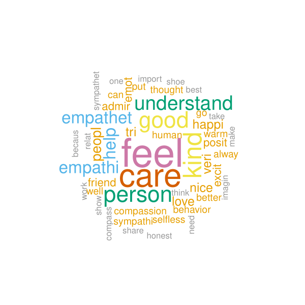
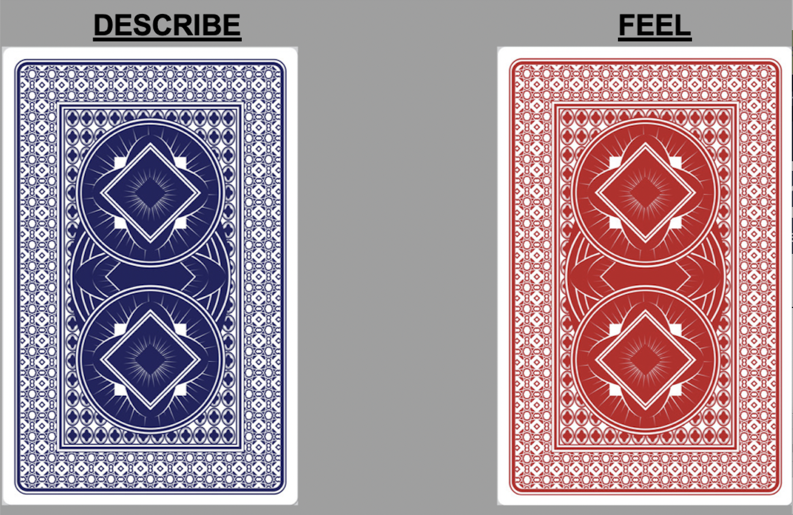

<style>

table, td, th {
  border: none;
  padding-left: 1em;
  padding-right: 1em;
  margin-left: auto;
  margin-right: auto;
  margin-top: 1em;
  margin-bottom: 1em;
}

</style>

```{cat, engine.opts = list(file = "color-text.lua")}
Span = function(span)
  color = span.attributes['color']
  -- if no color attribute, return unchange
  if color == nil then return span end
  
  -- tranform to <span style="color: red;"></span>
  if FORMAT:match 'html' then
    -- remove color attributes
    span.attributes['color'] = nil
    -- use style attribute instead
    span.attributes['style'] = 'color: ' .. color .. ';'
    -- return full span element
    return span
  elseif FORMAT:match 'latex' then
    -- remove color attributes
    span.attributes['color'] = nil
    -- encapsulate in latex code
    table.insert(
      span.content, 1,
      pandoc.RawInline('latex', '\\textcolor{'..color..'}{')
    )
    table.insert(
      span.content,
      pandoc.RawInline('latex', '}')
    )
    -- returns only span content
    return span.content
  else
    -- for other format return unchanged
    return span
  end
end
```

<!-- # Packages: -->

```{r,echo=FALSE,eval=TRUE,message=FALSE,warning=FALSE}
rm(list=ls())

#install packages to knit images
require(printr)
require(knitr)
```

# Introduction

Attrition, the loss of study units from a sample, can often occur throughout an experimental study and at times pose a threat to inference. There are several studies, and accompanying R packages, that provide ex-post solutions to missingness such as double-sampling or extreme bounds. We provide a visually based guidance to assessing the types of missingness a study may have with a particular eye towards experimental and design adjustments a researcher can make after piloting a study.

# Usage

* Visualizing survey attrition across treatment condition and over-time.
* Utilizing and comparing balance tests at precise moments in the survey.
* Incorporating estimation and visualization of Manski bounds for studies suffering from problematic attrition.

# Assumptions

* Data must be *ordered by survey questions*, i.e. if respondents answered Q1 before Q2, the variable Q1 must appear before Q2 (i.e. in an earlier column) in the dataframe.
* When attrition is defined as completely leaving the survey. Hence, when attrition is reported in the package it does not count skippers, i.e. respondents who skipped a question(s) but continued later in the survey, as attrited. In the function `plot_attrition` users can count skippers by setting y = "responded". 
* For balance tests, treatment and control conditions must be defined. 

# Functions

## `attrition()`

### Description 

* Converts survey data into a frame that includes: 

    - `attrited` -- how many respondents attrited (left the survey) at each question. 
    - `proportion` -- number of attrited respondents / number of respondents who entered survey.
    - `prop_q` -- number of attrited respondents / number of respondents entering into the question.     - `questions` -- question names.
    - `responded` -- how many respondents responded in each question.
    - `prop_r` -- number of respondents who responded / number of respondents who entered survey.

### Arguments 

* `data` - a `data.frame` where variables are ordered by survey questions, such that earlier survey questions appear in smaller valued columns.

## `attrition_table()`

### Description 

* Yields same data.frame as function `attrition`, but converts it into a table. Allows to subset table by treatment and control groups, which yields several tables by condition.

### Arguments 

* `data` - a `data.frame` where variables are ordered by survey questions, such that earlier survey questions appear in smaller valued columns.
* `treatment_q` -  a `string` character that corresponds to treatment variable. When specified, the function yields several tables by condition.

## `plot_attrition()`

### Description 

* Plots attrition or response in survey data over time.

### Arguments 

*`data` must be data.frame. Note that this function works only if the order of variables = order of questions in the survey. Users must remove irrelevant observations, for instance individuals who did not meet quotas, so as not to confuse them with attrited respondents. Note that using the qualtrics embedded data feature users can note which respondents failed an attention check or were removed since they did not meet a quota.

*`y` is a character that corresponds to the Y axis. When y = `attrited`, attrition is plotted. When y= `responded` responses are plotted. Default is y = `attrited`.

*`freq` is a logical argument that notes whether Y axis is a raw number or a proportion. Default is freq=TRUE, which is the frequency of attrited OR responded respondents. When freq=FALSE Y axis is the proportion of total N (attrited OR responded), calculated as number of attrited OR responded divided by the number of respondents entering into the question.

*`treatment_q` is a character of name(s) of question(s) in which treatments were administered. Marked in the plot with a red vertical line.

*`outcome_q` is a character of name(s) of outcome question(s). Marked in the plot with a blue vertical line.

*`mycolors` is a character of color names to be used as values in `scale_colour_manual` argument in ggplot. Default is mycolors=NULL, which defaults to greyscale. `mycolors` must be == length of the unique values of the `treatment_q` variable. To use this argument, users should specify which color corresponds to which factor (for example, `treatment = "red"`).

*`title` is a character to be used for plot title.

*`total` is a logical argument that notes whether the total # of attrited/responded is plotted. Default is TRUE. Argument can be changed to FALSE only when `treatment_q` is full.

*`tline` is a logical argument that allows users to remove  treatment vline, default is `tline`=TRUE.

*`outcomeline` is a logical argument that allows users to remove outcome vlines, default is `outcomeline`=TRUE.

## `balance_cov()`

### Description 

* Tests whether specified covariates are balanced across specified treatment and control groups. Output is a t-test if covariate is a numeric or integer, and a 2-sample proportion test if covariate is a factor.

### Arguments 

* `data` - a data.frame, from which `treatment` and `question` are taken.
* `treatment` - a `string` character that corresponds to the name of the treatment variable. Note that values of said variable must be specified as `treatment` and `control`.
* `question` - a `string` character that corresponds to the name of the point in survey (question), for which balance test is required.
* `factor` - logical argument that specifies whether `question` is a factor. Default is `factor = FALSE` (i.e. question is a numeric or integer).
* `factor_name` - character that corresponds to specific factor (i.e. female), if question is a factor (i.e. sex).
* `p_adjust` - Vector of numbers that correspond to p-values obtained in all tests. Use this to adjust for p-values if running multiple tests.

## `balance_attrite()`

### Description 

* Tests whether specified treatment causes attrition in a specified question. Output is a logistic regression, regressing attrition (remain in survey=0, attrited=1) over specified treatment.

### Arguments 

* `data` - a data.frame, from which `treatment` and `question` are taken.
* `treatment` - a `string` character that corresponds to the name of the treatment variable. Note that values of said variable must be specified as `treatment` and `control`.
* `question` - a `string` character that corresponds to the name of the point in survey (question), for which balance test is required.

## `bounds()`

### Description 

* Yields extreme (Manski) bounds or trimming (Lee) bounds, using the `attrition` package by Alex Coppock.
 
### Arguments 

* `data` - a data.frame, from which `treatment` and `DV` are taken.
* `treatment` - a `string` character that corresponds to the name of the treatment variable. Note that values of said variable must be specified as `treatment` and `control`.
* `DV` - a `string` character that corresponds to the name of the outcome variable.
* `type` - character that corresponds to the type of bounds required (`"Manski"` or `"Lee"`). Default is `type = "Manski"`.


## `vis_miss_treat()`

### Description 

* Calls the `vis_miss` function from `visdat` package. We allow users to facet missingness by conditions, creating several missingness maps per condition.
 
### Arguments 

* `data` - a data.frame.
* `treatment_q` - a `string` character that corresponds to the name of the treatment variable. If treatment_q = NULL, missingness map appears for all data, when treatment_q is not NULL, missingness is faceted by condition.

# Example

Let's begin demonstrating the uses of `attritevis`, with a working example. We begin by installing the package.

```{r install-package, echo=FALSE, eval=TRUE, message=FALSE,warning=FALSE}
if(!require(devtools)) install.packages("devtools")
install_github("lbassan/attritevis", dependencies = TRUE)
```

We load test data from Lo, Renshon, and Bassan-Nygate 2021 (study 5B) which is an experimental survey study on whether peer-praise can encourage respondents to choose an empathy task. 

```{r call-data, echo=FALSE, eval=TRUE, message=FALSE,warning=FALSE}
#Load data
test_data<-read.csv("test_data.csv") 
test_data$X<-NULL #remove running numbers
```

The experiment manipulates peer-praise and measures empathy in a behavioral task. There are two arms in the peer-praise randomization: peer-praise and no praise (control). In the first arm, a word cloud of praise, drawn from real praise collected in a pilot study, is given for people who behave empathetically, with a line of text about peer group average thermometer ratings towards people who are empathetic -- "Peers of yours on this platform have said they hold favorable feelings towards people who engage in empathetic behavior, with an average of 7.9, on a scale of 0 (least favorable) to 10 (most favorable), That same peer group provided real feedback for empathetic behavior which is pictured in the word cloud below”. The word cloud is presented in  figure 1. Respondents in the control condition do not receive any additional information.

```{r fig1, echo=FALSE, fig.cap="Figure 1: Word cloud of real praise presented to treated respondents.", out.width = '50%'}

```

Our outcome of interest is choosing to empathize with an image in a behavioral task. In the task, subjects choose between two "cards" a FEEL and a DESCRIBE task, that correspond to an empathy or objective task, in which they empathize/describe an image of a man. The cards are presented in figure 2. Below is a description of the survey, with information on the various variables collected.

```{r fig2, echo=FALSE, fig.cap="Figure 2: Choice task FEEL and DESCRIBE cards.", out.width = '50%'}

```

After answering pre-treatment covariates, respondents in the study were asked to complete two practice rounds of the main empathy task. After completing the practice rounds, respondents complete three trials of the above mentioned tasks. Before each task, respondents are randomized into treatment and control groups. Treated respondents received the light-touch peer-praise treatment. During each trial, before respondents select between the FEEL and DESCRIBE tasks, happiness, the hypothesized mechanism, is measured. Treatment variables are labeled `treat1`, `treat2`, etc. Outcome variables, which are the choice-task card questions, are labeled `card1`, `card2`, etc. Mediators, which are measures of the emotion happiness, are labeled `Happy_1_1`, `Happy_1_2`... `Happy_2_1`, `Happy_2_2`... `Happy_3_1`, `Happy_3_1`, etc. After respondents complete all three trials post-task and post-treatment covariates are collected. Importantly, the dataframe `test_data` is organized based on the survey questions order. That is, if Q1 came before Q2 in the survey, the variable Q1 comes before the variable Q2 in the dataframe. 

After loading the test data and ensuring that variables are ordered by survey questions, we may want to transform our dataframe to an attrition dataframe, using the function `attrition`.

## Attrition dataframe
```{r attrition dataframe A, echo=TRUE, eval=TRUE, message=FALSE,warning=FALSE}
attrition_data <- attritevis::attrition(test_data)
```

This function creates a frame that indicates, per question:

    - `attrited` -- how many respondents attrited (left the survey) at each question. 
    - `proportion` -- number of attrited respondents / number of respondents who entered survey.
    - `prop_q` -- number of attrited respondents / number of respondents entering into the question.     - `questions` -- question names.
    - `responded` -- how many respondents responded in each question.
    - `prop_r` -- number of respondents who responded / number of respondents who entered survey.

Using base `R` we can explore how many people attrited overall, and what proportion of the general population this is.

```{r arrtition dataframe B, echo=TRUE, eval=TRUE, message=FALSE,warning=FALSE}
sum(attrition_data$attrited) #How many respondents attrited overall?
sum(attrition_data$attrited)/nrow(test_data) #What proportion of the overall sample is this? (0.21)
```

Next, we can look at specific variables, and learn whether respondents attrited. Let's choose the variable `cards_a` to demonstrate. This is a variable that notes whether respondents clicked the "FEEL" or "DESCRIBE" button during their first practice round. Using base `R` we can extract the number of attrited respondents, as well as the proportion of total N attrited, for this question.

```{r arrtition dataframe C, echo=TRUE, eval=TRUE, message=FALSE,warning=FALSE}
attrition_data[attrition_data$questions == 'cards_a', 'attrited']
attrition_data[attrition_data$questions == 'cards_a', 'proportion']
```

We learn that at the question `cards_a` 37 respondents attrited from the survey. This is equivalent to 6% of the number of respondents who entered the survey at this question. Is this a lot though? Where else do we see attrition in the study? To assess, we visualize attrition across the survey timeline.

## Attrition table

We can further create that of this dataframe using the function `attrition_table`.

```{r arrtition table 1, echo=TRUE, eval=TRUE, message=FALSE,warning=FALSE}
attritevis::attrition_table(test_data)
```

We can also use the argument `treatment_q` to facet attrition table by condition. This is a character that corresponds to a specific variable, which is where the treatment conditions were administered.

```{r arrtition table 2, results='asis'}
attritevis::attrition_table(data= test_data,
                treatment_q = "treat1"
                )
```

## Visualizing attrition

### Attrition timeline

We may want to visualize attrition across the survey, to look at all the survey questions at once. The function `plot_attrition` allows us to plot attrition across survey questions, indicating where treatment and outcome questions were collected.

There are several ways in which users can use this function. Simply plugging in the dataset into the function yields a figure that plots the number of respondents that attrited (left the survey completely) over each question in the study. 

```{r plot_attrition A, echo=TRUE, eval=TRUE, message=FALSE,warning=FALSE}
attritevis::plot_attrition(test_data)  
```

When users specify `freq=FALSE`, the y axis plots the proportion of attrited. 

```{r plot_attrition B, echo=TRUE, eval=TRUE, message=FALSE,warning=FALSE}
attritevis::plot_attrition(test_data,
              freq=FALSE)  
```

Users can further specify `y="resonded"` to account for response, rather than attrition. This argument can be used with either freq=TRUE (default), or freq=FALSE, plotting response or proportion of responded, accordingly.

```{r plot_attrition C, echo=TRUE, eval=TRUE, message=FALSE,warning=FALSE}
attritevis::plot_attrition(test_data,
              y="responded")  
```

Using the `outcome_q` argument, users can specify where outcome questions were measure. These are noted with gray vertical lines.

```{r plot_attrition D, echo=TRUE, eval=TRUE, message=FALSE,warning=FALSE}
attritevis::plot_attrition(test_data,
              outcome_q = c("cards1", "cards2",  "cards3"))  
```

When `treatment_q`, which corresponds to treatment variable, is not NULL, the plot both notes where treatment was collected with a vertical line, and breaks down attrition by treatment conditions. 

```{r plot_attrition E, echo=TRUE, eval=TRUE, message=FALSE,warning=FALSE}
attritevis::plot_attrition(test_data,
              y = "responded",
              outcome_q = c("cards1", "cards2",  "cards3"),
              treatment_q = "treat1")

```

Color default is greyscale, but users can use the `mycolors` argument to specify which colors they want to use to mark each conditions' geom_line. The length of `mycolors` must be equal to the length of unique(`treatment_q`). To use this argument, users should specify which color corresponds to which factor. See below the running example:

```{r plot_attrition F, echo=TRUE, eval=TRUE, message=FALSE,warning=FALSE}
attritevis::plot_attrition(test_data,
              y = "responded",
              outcome_q = c("cards1", "cards2",  "cards3"),
              treatment_q = "treat1",
              mycolors = c(treatment = "#000066",
                           control = "#CC0033"))

```

Finally, users can make manual changes to the plot by removing the `Total` line (using the argument `total = FALSE`), and by removing the treatment and/or outcome vertical lines (using `tline=FALSE`, and/or `outcomeline=FALSE`, respectively). Generally, we recommend keeping the `Total` line unless treatment is administered at with entrance to study.

```{r plot_attrition G, echo=TRUE, eval=TRUE, message=FALSE,warning=FALSE}
attritevis::plot_attrition(test_data,
              y = "responded",
              outcome_q = c("cards1", "cards2",  "cards3"),
              treatment_q = "treat1",
              mycolors = c(treatment = "#000066",
                           control = "#CC0033"),
              total = FALSE,
              outcomeline = FALSE,
              tline = FALSE
            )

```


### Vis miss

Users can also visualize missingness with the `vis_miss_treat()` function that calls the `vis_miss` function from the `visdat` package.

```{r vis miss A, echo=TRUE, eval=TRUE, message=FALSE,warning=FALSE}
attritevis::vis_miss_treat(test_data)
```

`attritevis` allows users to facet missingness by conditions, creating several missingness maps per condition, and marks treatment variable with a red vertical line.

```{r vis miss B, echo=TRUE, eval=TRUE, message=FALSE,warning=FALSE}
attritevis::vis_miss_treat(test_data,
               treatment_q = "treat1")
```

## Balance tests

Once we have identified the specific survey points where attrition takes place, we want to conduct balance tests at these specific points to ensure balance across treatment and control, and learn if (and when) balance became an issue. We can do this using the functions `balance_cov()` and `balance_attrite()`.

### Balance across covariates

Once we've identified whether (and when) attrition occurs in our survey, we want to know that our treatment and control groups are balanced across covariates throughout the survey, to detect differential attrition. We can do this using the function `balance_cov()`, which we will demonstrate with three covariates: `age`, `sex`, and `ideology.`

We begin with the covariate `age`, which was collected pretreatment and is a numeric variable. In order to use the function `balance_cov()` we must define `treatment` and `control` arms under the `treatment` variables. We define `treat1` as the treatment variable, and `age` as the question.

```{r balance, echo=TRUE, eval=TRUE, message=FALSE,warning=FALSE}
unique(test_data$treat1)

attritevis::balance_cov(data = test_data, 
        treatment = "treat1", 
        question = "age")

```

The output is a t-test that determines whether there is a difference between the average age of the control group and the treatment group. We learn that age is balanced across treatment and control groups, with a mean of approximately 37.4 years old in treated respondents and 37.7 in controled respondents (p=0.7). 

We can also use the function `balance_cov()` when the covariate (`question`) is a factor, but we must specify which factor we are interested in. For example, let's say we want to test whether at the question `sex` in the survey missingness created observable differences across treatment and control groups. Sex is a factor variable with two factors: female and male. We can look at whether the proportion of female still remains similar across groups. To do so, we must determine that `factor = TRUE` and specify the `factor_name` (in this case, female).

```{r balance 2, echo=TRUE, eval=TRUE, message=FALSE,warning=FALSE}

attritevis::balance_cov(data = test_data, 
        treatment = "treat1", 
        question = "sex",
        factor = TRUE,
        factor_name = "female")

```

The output is a 2-sample proportion test. We learn that sex is also balanced between treatment and control, with similar proportions of females across the groups (p=0.3). 

There are certain post-treatment variables for which we may want to ensure balance across treatment and control as well. Note, however, that these should be variables that we hypothesize would stay stable after treatment. For example, we occasionally include demographic questions at the end of the survey to avoid survey fatigue before treatments. In our running example, the `ideology` question was collected post-treatment, but we expect it to stay stable across treatment and control.

```{r balance 3, echo=TRUE, eval=TRUE, message=FALSE,warning=FALSE}

attritevis::balance_cov(data = test_data, 
        treatment = "treat1", 
        question = "ideology")

```

If users run several balance tests, we recommend adjusting p-values. `balance_cov` allows users to do so by specifying the p-values of the tests they ran (p_adjust).

In our running example, since we ran three balance tests (with ideology, sex, and age), we want to adjust our p-values:

```{r balance 3a, echo=TRUE, eval=TRUE, message=FALSE,warning=FALSE}

attritevis::balance_cov(data = test_data, 
        treatment = "treat1", 
        question = "ideology",
        p_adjust = c(0.7,0.3,0.3))

```

### Balance across attrition 

Next, we can check whether our treatment is correlated with attrition at any moment in the survey. The `balance_attrite()` function converts the specified `question` into a binary variable such that attrition = 1, and remaining in survey = 0, and runs a lositic regression (regressing the specified `question` over the specified `treatment`) to examine whether treatment affects attrition. 

Using our visualization, we identified that attrition occurs at the post-treatment question `Happy_3_1`. We can use the function `balance_attrite()`, to examine whether our treatment caused attrition at this point in the survey:

```{r balance 4, echo=TRUE, eval=TRUE, message=FALSE,warning=FALSE}

attritevis::balance_attrite(data = test_data, 
        treatment = "treat1", 
        question = "Happy_3_1")

```

We learn that our `treat1` does not affect attrition in variable `Happy_3_1`.


# Simulated data

As we demonstrated above, attrition doesn't seem to pose a threat to inference in our dataset. But what does it look like when attrition is an issue? We simulate attrition on `test_data` to demonstrate what this would look like. 

## Treatment causes attrition

In a toy example (`test_sim`), suppose respondents enter a survey (Q1-Q10), where treatment is assigned at "Q5". We generate attrition such that treatment is causing respondents to drop out of the survey right after treatment. We might see something like this if respondents are particularly taxed by a treatment in the survey and therefore more likely to drop out after receiving treatment.

```{r simulate 1, include = FALSE}

#Attition post-treatment (throughout survey)
n <- 1000
test_sim <- data.frame(
Q1 = "agree", #consent
Q2 = sample(c(18:90), n, rep = TRUE), #age
Q3 = sample(c("m", "f"), n, rep = TRUE, prob = c(0.55, 0.45)), #sex
Q4 = sample(c(0,1), n, rep = TRUE),
Q5 = sample(c("treatment", "control"), n, rep = TRUE), #treatment
Q6 = sample(1:7, n, rep = TRUE),
Q7 = sample(1:7, n, rep = TRUE),
Q8 = sample(1:7, n, rep = TRUE),
Q9 = sample(1:7, n, rep = TRUE),
Q10 = sample(1:7, n, rep = TRUE))#other general pre-treatment questions


#First, we generate some general attrition throughput
invisible(
sapply(sample(1:nrow(test_sim), 500, 0.8*nrow(test_sim)),function(x) {
    a <- sample(1:10,1)
    test_sim[x,a:ncol(test_sim)] <<- NA
}
))

#second, we add some attrition that's correlated with the treatment
#specifically, we want to demonstrate attrition that happens at a certain time 
#to do so, we add a running var that will demonstrate time
test_sim$no<-rownames(test_sim)
test_sim$Q6<-ifelse(test_sim$Q5=="treatment"&(test_sim$no>200&test_sim$no<300), NA,test_sim$Q6)
test_sim$Q7<-ifelse(is.na(test_sim$Q6),NA,test_sim$Q7)
test_sim$Q8<-ifelse(is.na(test_sim$Q6),NA,test_sim$Q8)
test_sim$Q9<-ifelse(is.na(test_sim$Q6),NA,test_sim$Q9)
test_sim$Q10<-ifelse(is.na(test_sim$Q6),NA,test_sim$Q10)
test_sim$no<-NULL

```

### Plot

We visualize attrition using the `plot_attrition()` and `vis_miss_treat()` functions.

```{r plot_attrition sim1, echo=TRUE, eval=TRUE, message=FALSE,warning=FALSE}

attritevis::plot_attrition(test_sim,
              treatment_q = "Q5",
              outcome_q = c("Q7", "Q8",  "Q9"),
              freq = FALSE,
              mycolors = c(treatment = "#000066",
                           control = "#CC0033")
              )

```

```{r vis miss sim1, echo=TRUE, eval=TRUE, message=FALSE,warning=FALSE}

attritevis::vis_miss_treat(test_sim, treatment_q = "Q5")

```

We learn that attrition mostly occurs after Q6, and that treated respondents seem to be attriting more.

### Balance

We learn that most respondents attrite at the post-treatment question `Q6`, and conduct a balance test. Note that `Q6` is an outcome, and we expect our treatment to affect it. It thus does not make sense to use the `balance_cov()` function. Instead, we want to examine whether our treatment caused attrition, and thus use the function `balance_attrite()`: 

```{r balance sim1, echo=TRUE, eval=TRUE, message=FALSE,warning=FALSE}
attritevis::balance_attrite(data = test_sim, 
        treatment = "Q5", 
        question = "Q6")
```

We learn that treated respondents are more likely to attrite, treatment is positively associated with attrition and is statistically significant.

### Bounds

Next, we use the function `bounds()` to to get extreme value (Manski) bounds. This function calls the function `estimator_ev` from the `attrition` package by Alex Coppock. `treatment` is the assignment indicator (Z). `DV` is the outcome of interest (Y). Our `bounds()` function removes respondents who attrited pre-treatment and calculates R (the respose indicator variable) based on missingness on the DV (missing=0, response=1), based on the assumptions drawn by Manski.

```{r plot bounds a1, include = FALSE}
#manski bounds
attritevis::bounds(data = test_sim, 
       treatment = "Q5",
       DV = "Q7")

```

The default for the bounds type is `type = "Manski"`, but we can also specify the type of bounds such that `type = "Lee"` to get Trimming (Lee) bounds. Since we cannot defy the monotonicity assumption, Lee bounds cannot be yielded here, however we demonstrate the use of `type = "Lee"` in the next section.

## Control causes attrition

We repeat this process, but instead we look at a case where control causes attrition in `test_sim2`. We might see something like this if positive emotions (like happiness) are ramped up with treatment, making attrition less likely.

```{r simulate 2, include = FALSE}

#Attition post-treatment (throughout survey)
n <- 1000
test_sim2 <- data.frame(
Q1 = "agree", #consent
Q2 = sample(c(18:90), n, rep = TRUE), #age
Q3 = sample(c("m", "f"), n, rep = TRUE, prob = c(0.55, 0.45)), #sex
Q4 = sample(c(0,1), n, rep = TRUE),
Q5 = sample(c("treatment", "control"), n, rep = TRUE), #treatment
Q6 = sample(1:7, n, rep = TRUE),
Q7 = sample(1:7, n, rep = TRUE),
Q8 = sample(1:7, n, rep = TRUE),
Q9 = sample(1:7, n, rep = TRUE),
Q10 = sample(1:7, n, rep = TRUE))#other general pre-treatment questions


#First, we generate some general attrition throughput
invisible(
sapply(sample(1:nrow(test_sim2), 500, 0.8*nrow(test_sim2)),function(x) {
    a <- sample(1:10,1)
    test_sim2[x,a:ncol(test_sim2)] <<- NA
}
))

#second, we add some attrition that's correlated with the treatment
#specifically, we want to demonstrate attrition that happens at a certain time 
#to do so, we add a running var that will demonstrate time
test_sim2$no<-rownames(test_sim2)
test_sim2$Q6<-ifelse(test_sim2$Q5=="control"&(test_sim2$no>200&test_sim2$no<300), NA,test_sim2$Q6)
test_sim2$Q7<-ifelse(is.na(test_sim2$Q6),NA,test_sim2$Q7)
test_sim2$Q8<-ifelse(is.na(test_sim2$Q6),NA,test_sim2$Q8)
test_sim2$Q9<-ifelse(is.na(test_sim2$Q6),NA,test_sim2$Q9)
test_sim2$Q10<-ifelse(is.na(test_sim2$Q6),NA,test_sim2$Q10)
test_sim2$no<-NULL

```

### Plot

We visualize attrition using the `plot_attrition()` and `vis_miss_treat()` functions.

```{r plot_attrition sim2, echo=TRUE, eval=TRUE, message=FALSE,warning=FALSE}

attritevis::plot_attrition(test_sim2,
              treatment_q = "Q5",
              outcome_q = c("Q7", "Q8",  "Q9"),
              freq = FALSE,
              mycolors = c(treatment = "#000066",
                           control = "#CC0033")
              )

```

```{r vis miss sim2, echo=TRUE, eval=TRUE, message=FALSE,warning=FALSE}

attritevis::vis_miss_treat(test_sim2, treatment_q = "Q5")

```

We learn that attrition mostly occurs after Q6, and that treated respondents seem to be attriting more.

### Balance

We learn that most respondents attrite at the post-treatment question `Q6`, and conduct a balance test. Note that `Q6` is an outcome, and we expect our treatment to affect it. It thus does not make sense to use the `balance_cov()` function. Instead, we want to examine whether our treatment caused attrition, and thus use the function `balance_attrite()`: 

```{r balance sim2, echo=TRUE, eval=TRUE, message=FALSE,warning=FALSE}
attritevis::balance_attrite(data = test_sim2, 
        treatment = "Q5", 
        question = "Q6")
```

We learn that treated respondents are more likely to attrite, treatment is positively associated with attrition and is statistically significant.

### Bounds

Next, we use the function `bounds()` to to get extreme value (Manski) bounds and lee sharp bounds.

```{r bounds manski 2, echo=TRUE, eval=TRUE, message=FALSE,warning=FALSE}
attritevis::bounds(data = test_sim2, 
       treatment = "Q5",
       DV = "Q8")

#lee sharp
attritevis::bounds(data = test_sim2, 
       treatment = "Q5",
       DV = "Q7",
       type = "Lee")

```